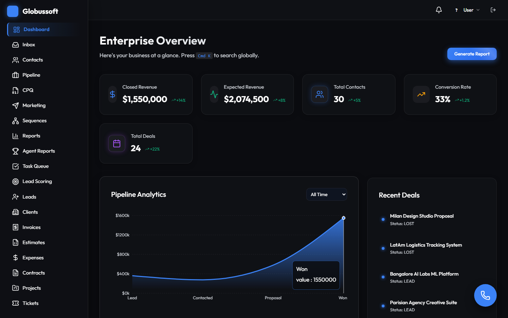
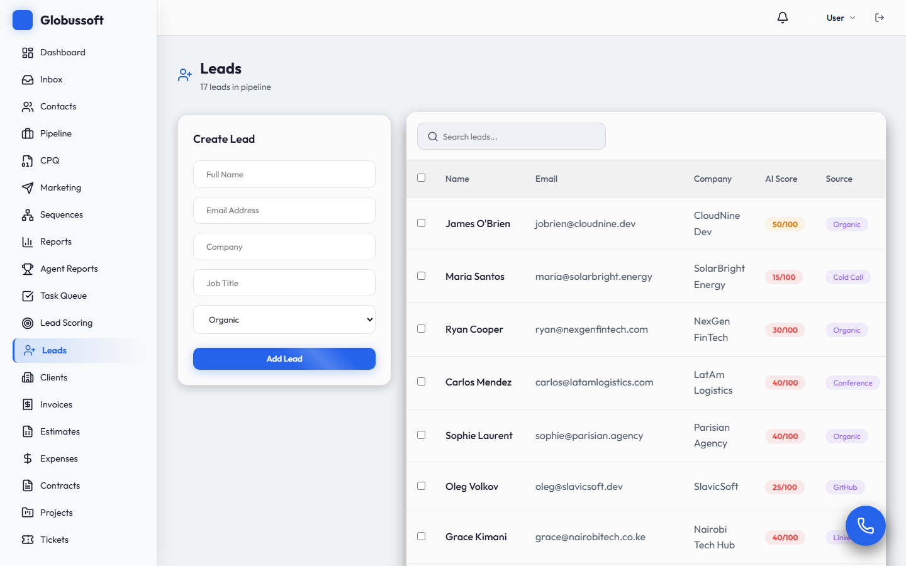
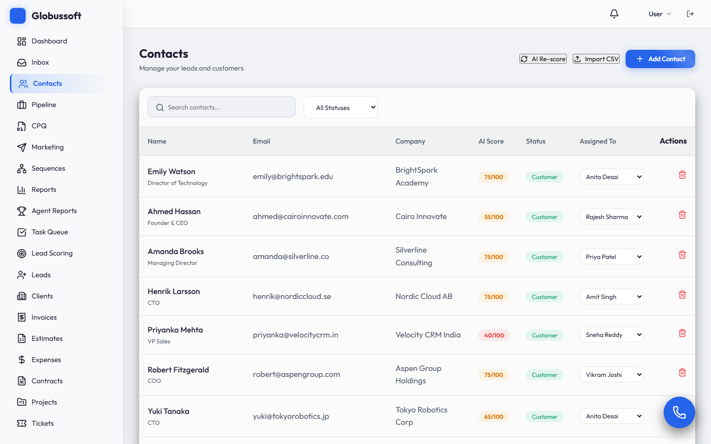
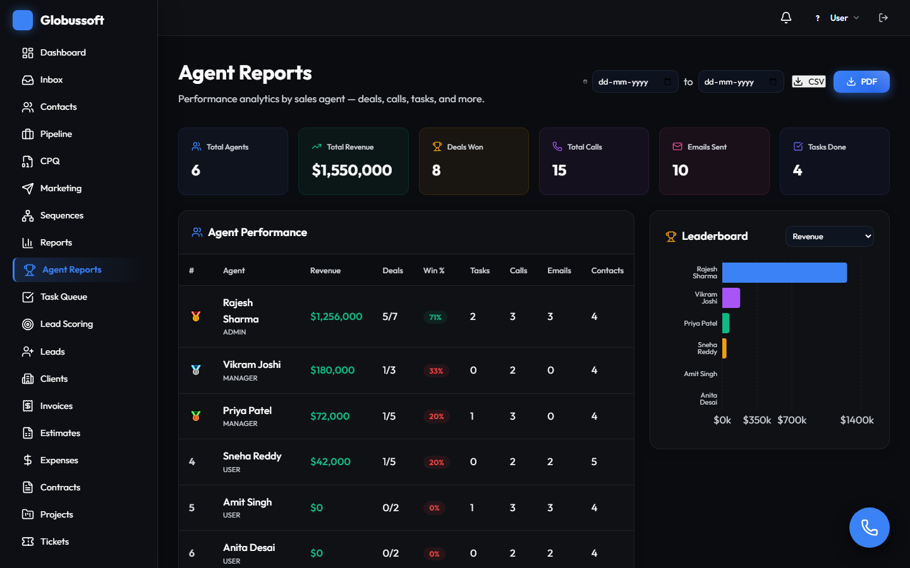
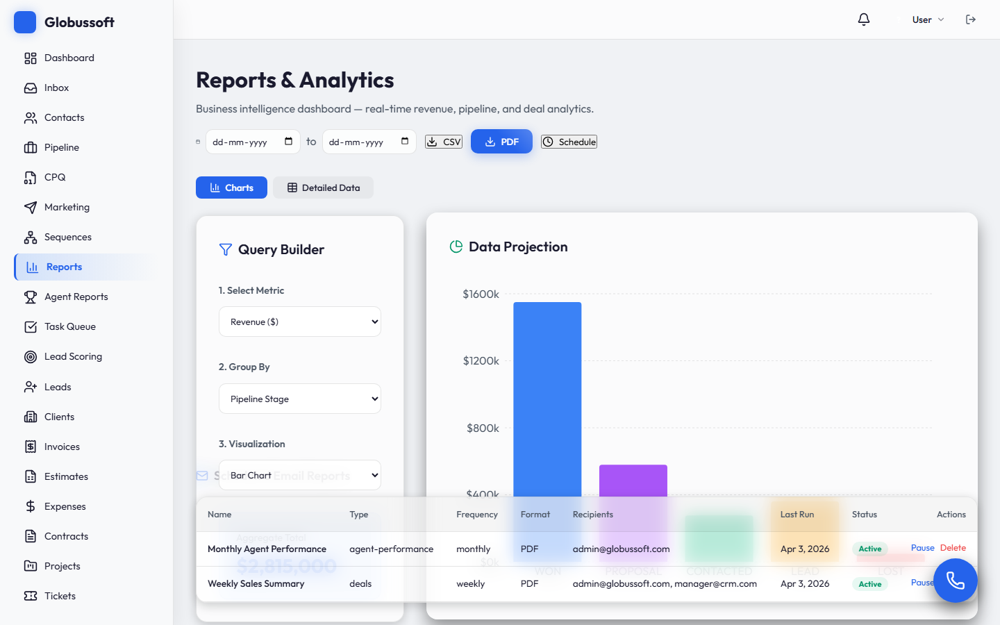
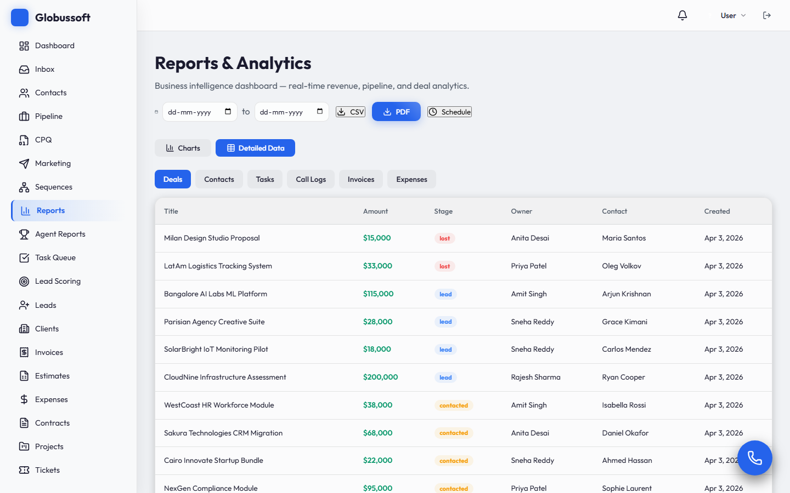
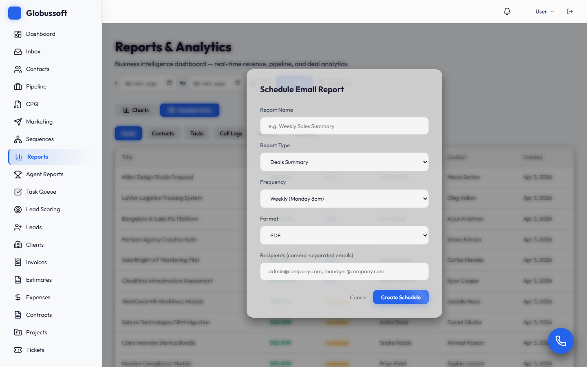

# Globussoft Enterprise CRM

> A full-stack enterprise CRM built by Globussoft Technologies with glassmorphism UI, AI-powered lead scoring, dark/light theme, and 25+ fully functional modules.

**Live:** [crm.globusdemos.com](https://crm.globusdemos.com) | **Version:** v2.0.0

## Tech Stack

| Layer | Technologies |
|-------|-------------|
| Frontend | React 18, Vite, React Router v6, React.lazy() code splitting, Lucide Icons, Recharts, ReactFlow, Socket.io-client |
| Backend | Node.js, Express.js, Prisma ORM, MySQL, Socket.io, node-cron, PDFKit, Nodemailer, express-rate-limit, Swagger UI |
| Auth | JWT (bcryptjs), RBAC: ADMIN / MANAGER / USER |
| Production | PM2, Nginx reverse proxy, Certbot SSL |
| Testing | Playwright E2E (40 spec files, 313+ tests) |
| Styling | Vanilla CSS with glassmorphism design, dark/light theme support |

---

## Feature Highlights

### Dashboard
Executive analytics overview with closed revenue, expected revenue, total contacts, conversion rate, pipeline chart, and recent deals. Date range filter (All Time / 7d / 30d / 90d / 365d).



---

### Agent Assignment on Leads
Assign sales agents to leads directly from the table. Supports individual assignment via dropdown and **bulk assignment** with multi-select checkboxes. Agents are fetched from the Staff directory.



---

### Agent Assignment on Contacts
Same agent assignment capability on the full Contacts page. Each contact row shows an "Assigned To" dropdown to quickly assign or reassign agents.



---

### Agent-wise Reports
Dedicated Agent Reports page with performance leaderboard. Tracks per-agent metrics: **revenue, deals won, win rate, tasks completed, calls made, emails sent, and contacts assigned**. Includes date range filters, CSV/PDF export, and a horizontal bar chart leaderboard. Click any agent row to see their recent deals and activity breakdown.



---

### Detailed Report Module (Charts)
Enhanced Reports & Analytics page with **8 metric types** (Revenue, Deal Count, Win Rate, Tasks, Contacts by Source/Status, Invoices, Expenses), date range filtering, and 3 chart types (Bar, Donut, Area). Includes Query Builder sidebar with aggregate totals.



---

### Detailed Report Module (Data Tables + Download)
Switch to "Detailed Data" tab to view raw data tables for **Deals, Contacts, Tasks, Call Logs, Invoices, and Expenses**. Each table shows full record details with owner/agent attribution. Supports **CSV and PDF download** of any report.



---

### Auto Email Reports (Scheduling)
Schedule automated email reports with configurable **frequency (Daily, Weekly, Monthly)**, **format (PDF/CSV)**, and **recipients**. Reports are generated by a cron engine and dispatched via Nodemailer. Manage active schedules with enable/disable toggle and delete.



---

### Marketplace Leads (India Market Integration)
Auto-import leads from **IndiaMART, JustDial, and TradeIndia** — India's largest B2B/B2C marketplaces. Supports both **real-time webhooks** and **cron-based API polling** (every 5 min). Features smart deduplication (by external lead ID, email, and normalized phone), one-click or bulk import into CRM contacts, provider-wise stats dashboard, and an admin configuration panel with webhook URL display.

**Key capabilities:**
- Webhook endpoints for each provider (no-auth, push-based)
- Scheduled API sync engine for pull-based lead fetching
- Phone number normalization (Indian 10-digit → +91 format)
- Duplicate detection across marketplace leads and existing contacts
- Auto-creates Contact + Deal on import with source attribution
- Real-time Socket.io notifications on new marketplace leads

---

## All Modules

### Sales & Pipeline
- **Dashboard** - Executive analytics (MRR, revenue, deal closures, pipeline charts)
- **Pipeline** - Kanban drag-and-drop deal board with real-time Socket.io sync
- **Contacts** - 360-degree B2B/B2C directory with AI scoring, phone tracking, and agent assignment
- **Leads** - Filtered contacts (status=Lead) with agent assignment, bulk assign, and convert-to-customer
- **Clients** - Filtered contacts (status=Customer) with search
- **Lead Scoring** - AI-powered scoring engine running on node-cron
- **Marketplace Leads** - Indian marketplace integration (IndiaMART, JustDial, TradeIndia) — auto-import leads via webhooks and cron-based API sync, smart deduplication, bulk import, config panel

### Reports & Analytics
- **Reports** - BI dashboard with 8 metrics, date filters, charts, data tables, PDF/CSV export
- **Agent Reports** - Per-agent performance leaderboard (deals, calls, tasks, emails, revenue, win rate)
- **Auto Email Reports** - Scheduled report delivery via email (daily/weekly/monthly, PDF/CSV)

### Automation & Communication
- **Sequences** - Visual drip campaign builder with ReactFlow (Email, SMS, WhatsApp, Push node types)
- **Workflows** - Automation rule engine with visual flow editor
- **Inbox** - Omnichannel communications (Email, Calls, SMS, WhatsApp)
- **Marketing** - Campaign management (Email, SMS, Push campaigns)
- **SMS Campaigns** - SMS via MSG91/Twilio, DLT compliance, templates with variable substitution
- **WhatsApp Business** - WhatsApp Cloud API, template approval workflow, chat-style inbox
- **Indian Telephony** - Click-to-call via MyOperator/Knowlarity, call recording, CDR webhooks
- **Push Notifications** - Web push (VAPID), CRM user + visitor subscriptions, marketing campaigns
- **Landing Page Builder** - No-code drag-and-drop builder with 4 templates, form submissions, analytics
- **Channels Settings** - Unified provider configuration for all communication channels

### Financial
- **Billing / Invoices** - Full CRUD with mark-paid, void, PDF download, status badges
- **Estimates** - Line-item estimates with convert-to-invoice
- **Expenses** - Category tracking with approve/reject/reimburse workflow
- **Contracts** - Contract lifecycle (Draft > Active > Expired > Terminated)
- **CPQ** - Configure-Price-Quote builder with deal selection and line-item schemas

### Project & Task Management
- **Projects** - Project management with budget, status, and task association
- **Task Queue** - Priority-based task management with status tracking

### Support
- **Tickets** - Support ticketing with priority/status/assignee
- **Support** - Customer helpdesk management with knowledge base

### Platform & Developer
- **App Builder** - Custom Objects with dynamic schemas from UI (EAV pattern)
- **Developer Portal** - API key provisioning and webhook configuration
- **Staff** - User directory with RBAC role management (ADMIN only)
- **Marketplace** - Integration catalog
- **Marketplace Leads** - IndiaMART / JustDial / TradeIndia lead ingestion with dedup engine
- **Settings** - Organization settings, pipeline stage management, dark/light theme toggle
- **Command Palette** - Quick navigation (Cmd+K / Ctrl+K)
- **Softphone** - Twilio VoIP integration
- **Real-time Presence** - Socket.io collaborative cursors
- **Notifications** - Bell icon with dropdown, unread badge, mark-all-read
- **Audit Log** - Entity/action tracking with user attribution
- **CSV Import** - Bulk contact import with preview

### Dark / Light Theme
Full theme support across all pages. Toggle from Settings > Appearance. Persists across sessions via localStorage. Uses CSS custom properties with `[data-theme="light"]` overrides.

## Getting Started

```bash
# Backend
cd backend && npm install
npx prisma generate && npx prisma db push
node prisma/seed.js   # Optional: seed demo data
npm run dev            # API on http://localhost:5000, Swagger at /api-docs

# Frontend
cd frontend && npm install
npm run dev            # UI on http://localhost:5173

# E2E Tests
cd e2e && npm install
npx playwright test --project=chromium
```

## Demo Credentials

| Role | Email | Password |
|------|-------|----------|
| Admin | admin@globussoft.com | password123 |
| Manager | manager@crm.com | password123 |
| User | user@crm.com | password123 |

## API

35 route modules, all prefixed with `/api/`, protected by JWT auth. Public landing pages served at `/p/:slug`.

Rate limiting: 5000 req/15min general, 1000 req/15min on auth.

Interactive docs at `/api-docs` (Swagger UI).

## E2E Testing

40 Playwright spec files with **313 tests, 100% passing** — covering all modules, API health, responsive design, theme toggle, and navigation flows.

```bash
cd e2e && npx playwright test --project=chromium
```

### Deep Workflow Test Results

10 end-to-end workflows verified against the live production deployment:

| # | Workflow | Result | Details |
|---|---------|--------|---------|
| 1 | Lead Creation + Agent Assignment | PASS | Created lead, assigned agent via dropdown, verified on both Leads and Contacts pages |
| 2 | Pipeline Deal Lifecycle | PASS | 6 stages rendered, 29 deals distributed, created deal via modal, opened detail view, drag-drop ready |
| 3 | Reports: Charts + Metrics | PASS | 3 metrics tested (revenue, deal count, win rate), chart renders, aggregate total $2.89M |
| 4 | Reports: Detailed Data Tables | PASS | 6 table types: Deals (27), Contacts (35), Tasks (21), Call Logs (17), Invoices (12), Expenses (12) |
| 5 | Reports: PDF + CSV Export | PASS | CSV returns proper headers + data rows, PDF generates valid document |
| 6 | Agent Reports | PASS | 6 agents in leaderboard, bar chart, stat cards, drill-down detail panel |
| 7 | Auto Email Report Scheduling | PASS | Full CRUD: create schedule, verify in table, toggle pause, delete |
| 8 | Forgot Password Flow | PASS | API returns reset token, password reset completes successfully |
| 9 | Invoice + Task + Ticket Management | PASS | Invoices (10 records, Mark Paid workflow), Tasks loaded, Tickets loaded |
| 10 | API Endpoint Health | PASS | 30/30 authenticated endpoints return 200 |

## Deployment

- **Domain:** crm.globusdemos.com
- **Architecture:** PM2 (backend) + Nginx (frontend static + reverse proxy) + Certbot SSL
- **Deploy flow:** git pull > npm install > prisma generate > vite build > copy dist to Nginx > pm2 restart

---

*Built by [Globussoft Technologies](https://globussoft.com)*
